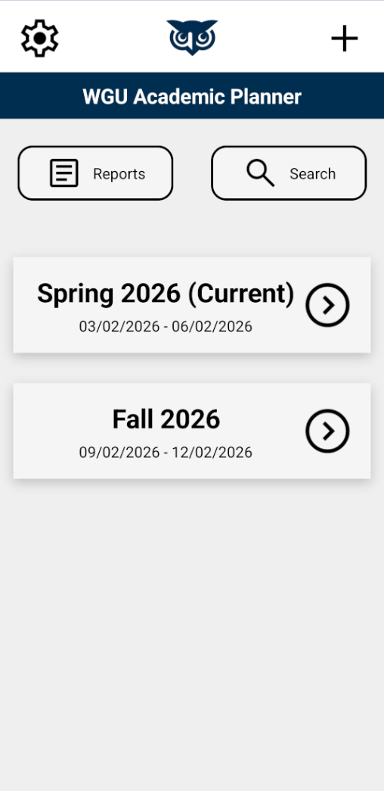
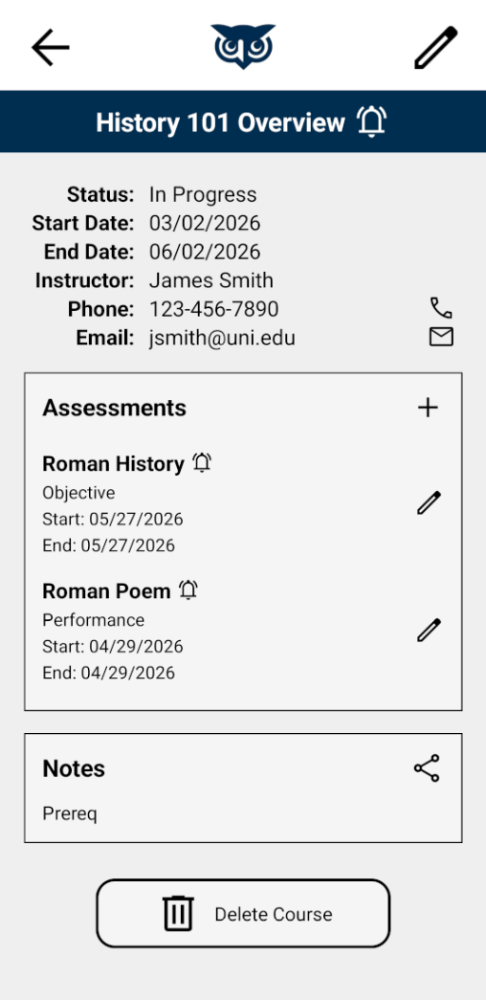
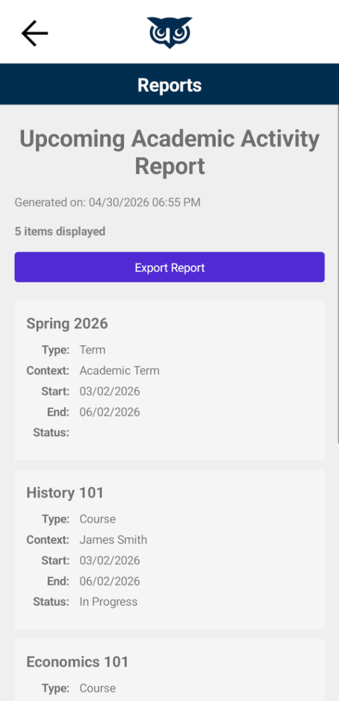

# Academic Planner Pro

Academic Planner Pro is a .NET MAUI Android application for managing academic terms, courses, assessments, alerts, notes, search, and reports.

The app uses local SQLite storage, account authentication, password hashing, notification scheduling, and CSV report export.

## Features

- Create and manage academic terms
- Add courses within terms
- Track course status, start dates, end dates, instructor information, and notes
- Add Objective and Performance assessments for each course
- Validate term, course, and assessment date ranges
- Search across terms, courses, and assessments
- Schedule local start and end alerts for courses and assessments
- Export upcoming academic activity to a CSV report
- Create a local user account with hashed password storage
- Optional PIN unlock
- Local SQLite persistence
- Unit tests for hashing, password validation, and academic validation rules

## Tech Stack

- C#
- .NET MAUI
- .NET 9
- Android
- SQLite
- sqlite-net-pcl
- xUnit

## Screenshots

### Terms Page

### Course Overview

### Reports

## How to Run

1. Clone the repository.

`git clone https://github.com/nencraft/academic-planner-pro.git`

2. Open the solution in Visual Studio.

`AcademicPlanner.sln`

3. Select an Android emulator or connected Android device.

4. Build and run the `AcademicPlanner` project.

## Demo Flow

1. Create a local account.
2. Add an academic term.
3. Add a course within the term.
4. Add instructor information and course notes.
5. Add one Objective assessment and one Performance assessment.
6. Enable course or assessment alerts.
7. Use Search to find a term, course, or assessment.
8. Open Reports and export upcoming academic activity.
9. Enable PIN unlock from Settings.

## How to Run Tests

Run the test project from the repository root:

`dotnet test AcademicPlanner.Tests/AcademicPlanner.Tests.csproj`

The test project covers non-UI logic, including:

- Password hashing
- Password verification
- Password validation rules
- Required field validation
- Date range validation
- Email validation
- Phone validation
- Assessment count rules
- Duplicate assessment type rules

## Project Structure

AcademicPlanner/

- `Data/`
  - SQLite database access
- `Helpers/`
  - Shared validation helpers
- `Models/`
  - Terms, courses, assessments, users, planner items, and report rows
- `Services/`
  - Authentication, hashing, search, reports, planner item generation, notifications, and seed data
- `Views/`
  - .NET MAUI pages
- `Platforms/Android/`
  - Android-specific notification code
- `Resources/`
  - App icons, images, fonts, and styles

AcademicPlanner.Tests/

- `Helpers/`
  - Validation helper tests
- `Services/`
  - Hashing and password validation tests

## Architecture

Academic Planner Pro uses a layered structure:

- Views handle UI and page-level user interactions.
- Services contain app logic such as authentication, search, reporting, planner item generation, and notification coordination.
- Data handles SQLite persistence.
- Models define the data objects used throughout the app.
- Platform-specific Android notification code is isolated under `Platforms/Android`.
- Tests focus on non-UI logic to keep the test suite stable and fast.

## Data Persistence

The app stores data locally using SQLite.

Stored data includes:

- User account information
- Terms
- Courses
- Assessments
- Course notes
- Alert settings
- Notification IDs
- PIN unlock settings

## Authentication and Security

Academic Planner Pro supports local account creation and login.

Security-related features include:

- Password hashing
- Password salts
- Password strength validation
- Optional PIN unlock
- No committed signing keys

Android signing keys are not included in this repository. Local release builds should use a developer-created keystore configured outside source control.

## Notifications

The app supports local Android notifications for course and assessment reminders.

Notification behavior includes:

- Course start reminders
- Course end reminders
- Assessment start reminders
- Assessment due reminders
- Stable notification IDs
- Notification cancellation when related academic items are deleted or updated

## Search

The Search page allows users to find:

- Terms
- Courses
- Assessments

Search results can be opened directly from the results list.

## Reports

The Reports page generates upcoming academic activity from terms, courses, and assessments.

Reports include:

- Item type
- Title
- Context
- Start date
- End or due date
- Status

Reports can be exported as CSV files.

## Validation Rules

The app enforces several academic planning rules:

- Required fields cannot be blank.
- Start dates cannot be after end dates.
- Course dates must fall within the selected term.
- Assessment dates must fall within the selected course.
- Instructor email must use a valid email format.
- Instructor phone must use a valid phone format.
- A course can have no more than two assessments.
- A course cannot have duplicate assessment types.
- Account passwords must meet basic strength requirements.

## Recent Improvements

- Removed committed Android signing key
- Cleaned repository ignore rules
- Added centralized planner item generation
- Improved academic date validation
- Added phone validation
- Added password strength validation
- Improved notification scheduling and cancellation
- Improved Search page empty-state behavior
- Improved Reports page summary and export feedback
- Added unit tests for core non-UI logic
- Updated project documentation and screenshots

## Future Improvements

- Add recurring reminders
- Add calendar export
- Add dark mode support
- Add cloud backup or sync
- Add filtering and sorting to reports
- Add more detailed assessment progress tracking
- Move shared business logic into a dedicated core library
